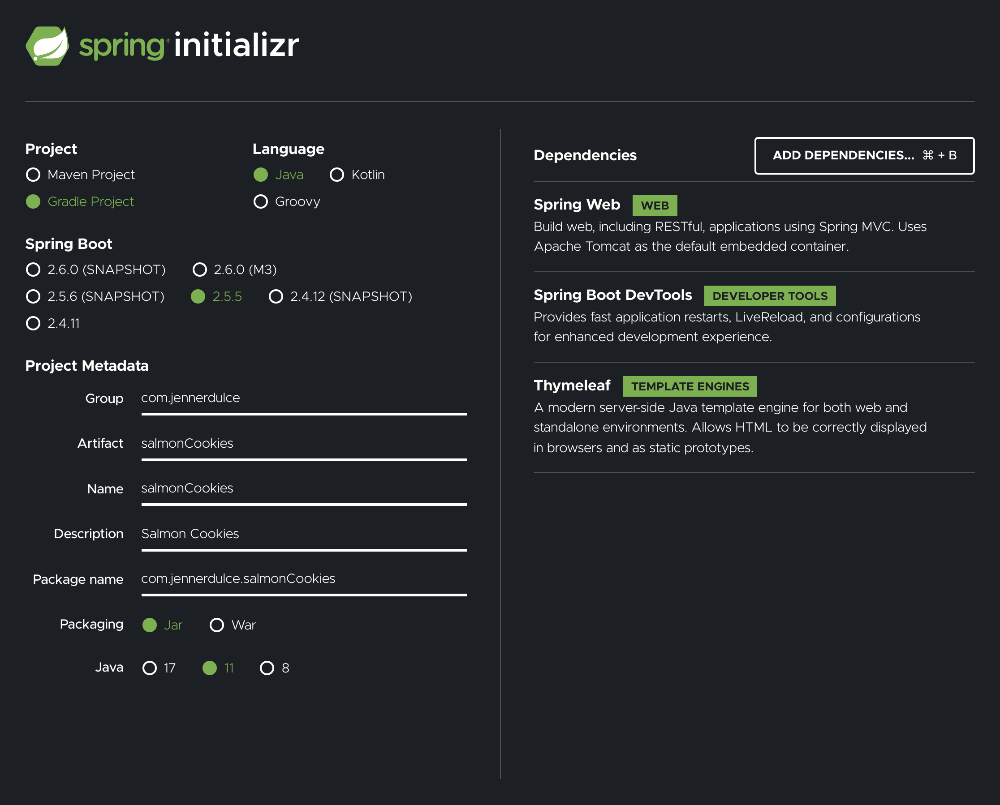
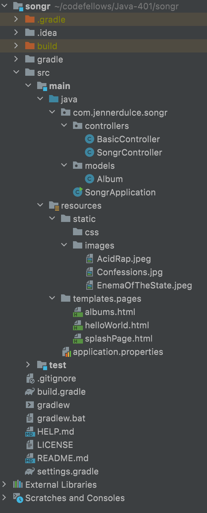
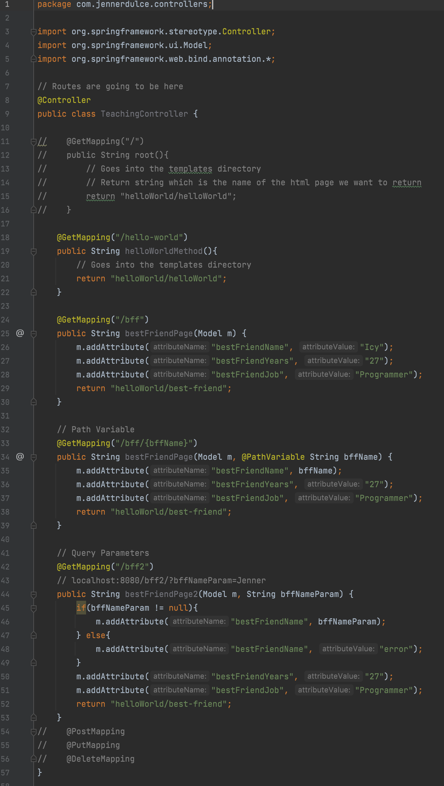
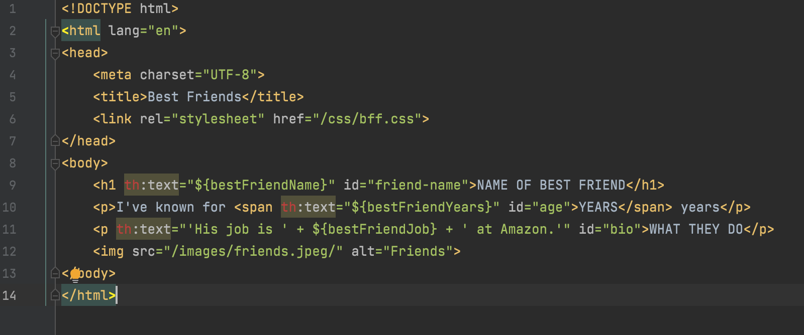
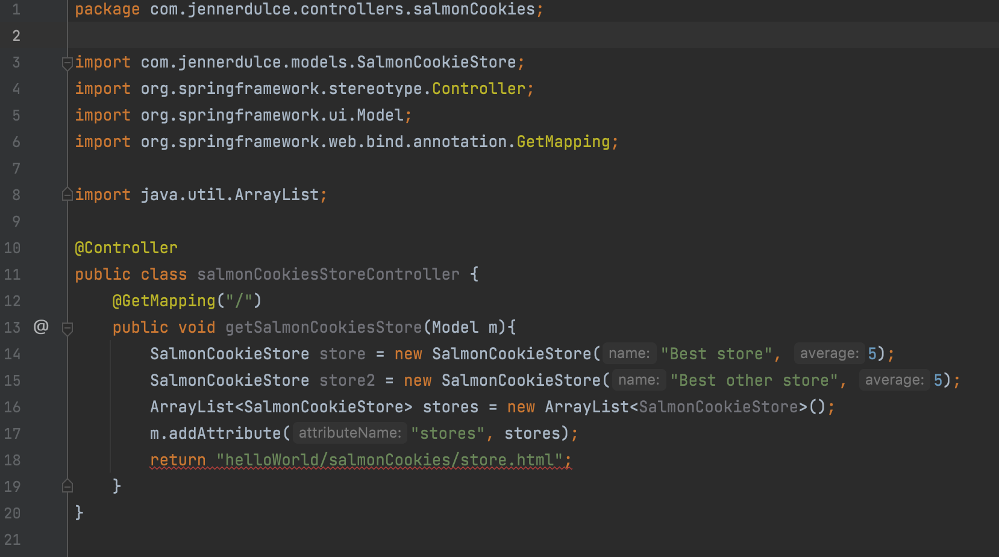
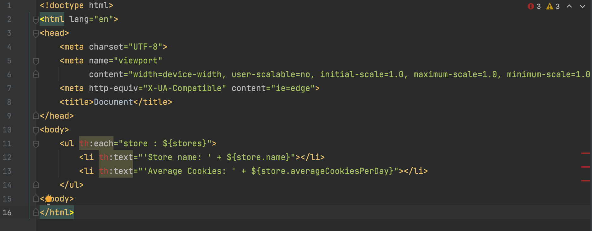

# Spring for Full-Stack Web Appcs

## Spring MVC

- Model View Controller
- Data, What viewer sees, Connection between the two

## Spring Boot

- Simpilier heavyweight Java framework
- Follow this convention, I will build out the whole website for you if you do this.
- Difficult to fix because of everything thats happening under the hood
- Utilizes annotations `@SpringBootApplication`
- Make controller, route, and run

### Controller

- Handle routing
- Logic
- Pages, error pages

### Timeleaf Templating

`<h1 th:text="${bestFirnedName}">Name of best friend</h1>`

// Path Variable
        // localhost:8080/bff/Chris

### Heroku Commands

- git init
- heroku login
- git status
- git add .
- git ocmmit -m "Inital salmon cookies store"
- heroku create appname
- make new file system.properties in src directory
  - java.runtime.version=11
- push
- make Procfile (no extension)
        - 
        gradel.w build
- git push heroku master

### Boilerplate

#### Spring initializr

- Create repo
- Use spring initializer and copy the files into the repo

#### Gradle Directory

- Be sure to create directories and packages to organize your files
- static
        - css
        - images
- templates
        - possibly create pages
        - contains html pages
- controllers
        - contain controller files
- models
        - models/classes
        - made to contain stores

#### Controller

#### Templating

##### Basic Templating

##### Handling Arrays

