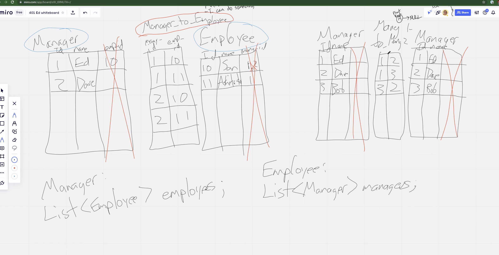

# Web App Security

- Do not ever write SQL by concatenating
- There are certain thigns that hibernate cannot do, which is where you would end up using SQL

## Prevent SQL Injection or HTML Injection

- Hibernate and JPA already protect you from these kinds of attacks
- In a form tag, people may put something like:
  - `<script th:utext="">Alert("hit");</script>`
- **xss crawler**

## Following / Many to Many

### Join table Manage-to-employee

```java
    @ManyToMany(mappedBy = "employees")
    Set<SomeUser> managers;
    
    
    @ManyToMany
    @JoinTable(
        name="managers_to_employees", // join table name
        joinColumns={@JoinColumn(name="manager")},
        inverseJoinColumns={@JoinColumn(name="employee")}
    )
    Set<SomeUser> employees;
```

- Will create the join table automatically

### How to add to the table

```java
personalAccount.getFollowing().add(followProfile);
applicationUserRepository.save(personalAccount);
return new RedirectView("/user/" + followProfile.getUsername());
``

## Preserve White Space

```html
style {
    white-space: pre
  }
```


